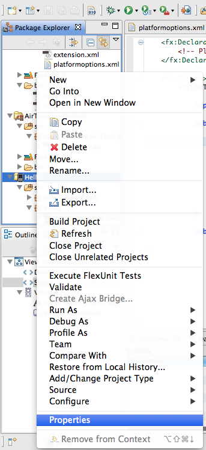
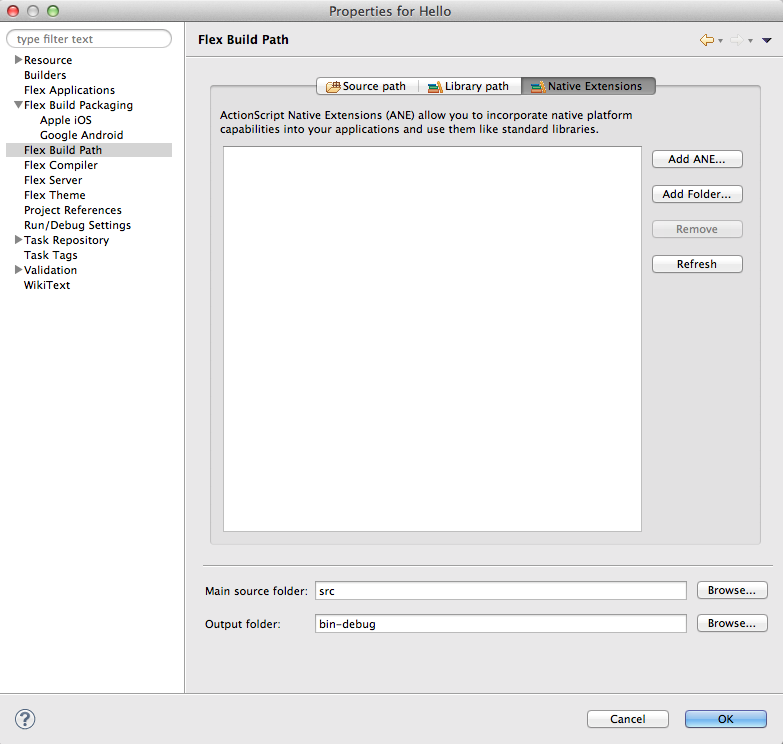
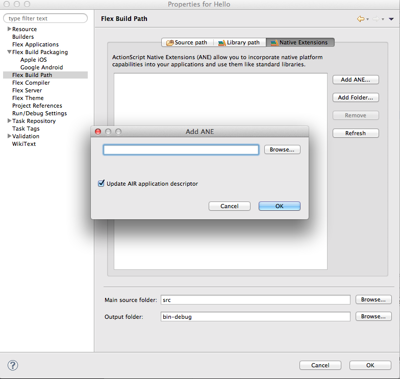
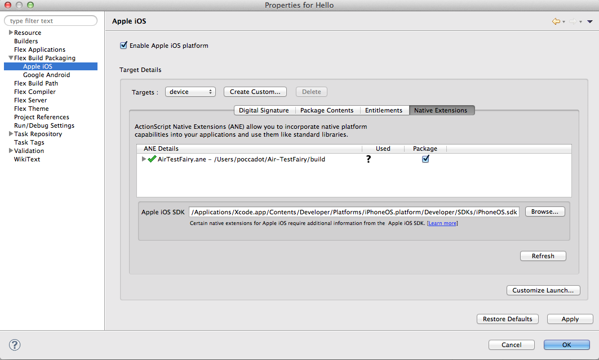
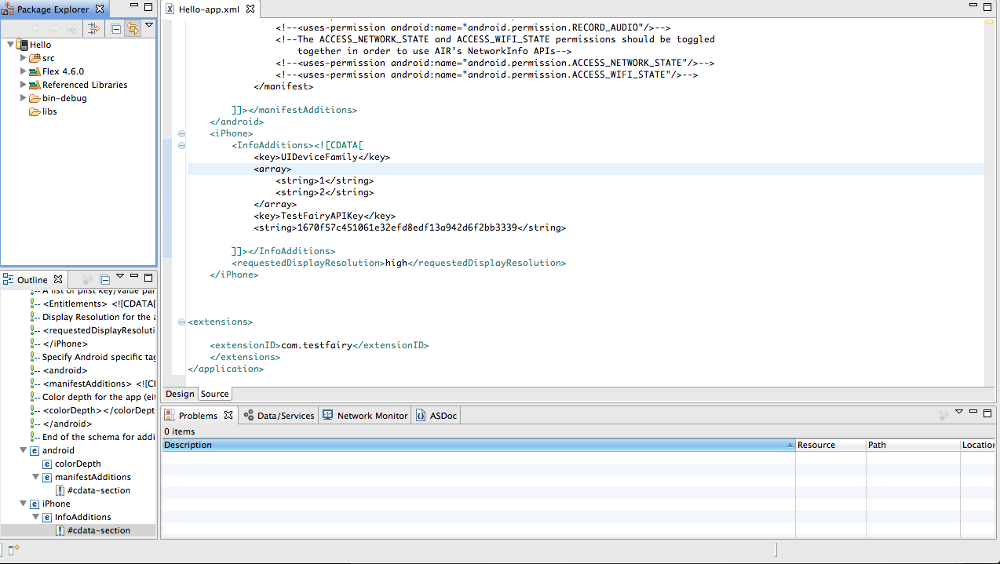

# TestFairy for ANE

Add AirTestFairy.ane to your project in order to enable TestFairy

* [Download](https://app.testfairy.com/ios-sdk/TestFairySDK-1.4.4.ane) and unzip the repository
* Go to your project properties

  
  
* Choose "Flex Build Path" from the properties and choose "Native Extensions" tab

  
  
* Press "Add ANE" on the left and add path to AirTestFairy.ane

  
  
* Go to "Flex Build Packaging" from the properties, choose "Apple iOS" and then "Native Extensions" tab. 
  Make sure the Package is selected
  
  
  
* In your projects PROJECT-NAME-app.xml add your *APP Token* as a value for "TestFairyAPIKey" key

  
  
* Import com.testfairy.AirTestFairy class and add AirTestFairy.begin() to your `onApplicationComplete` method.

```
  import com.testfairy.AirTestFairy;

  AirTestFairy.begin();
```

### You are ready to build and run your project
